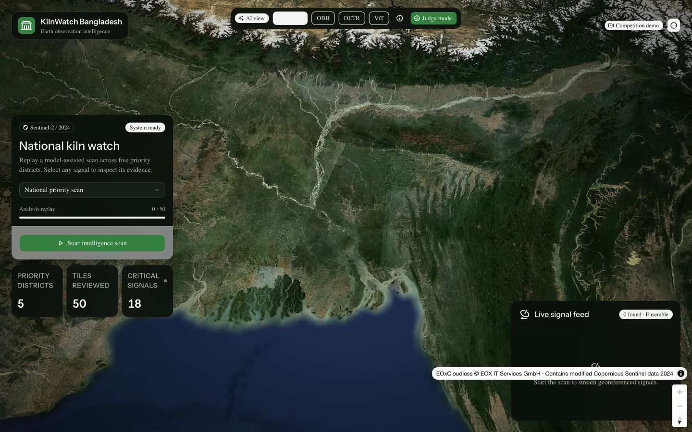
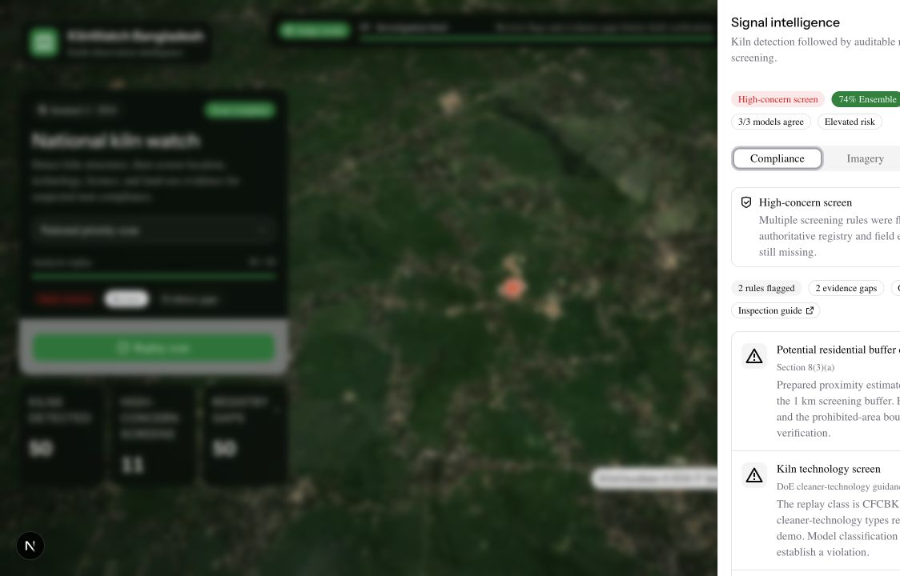
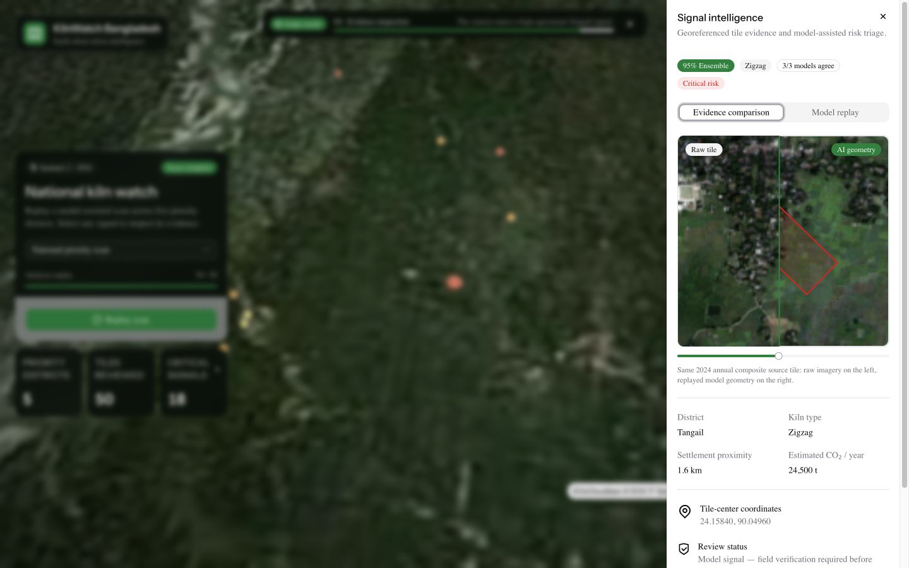
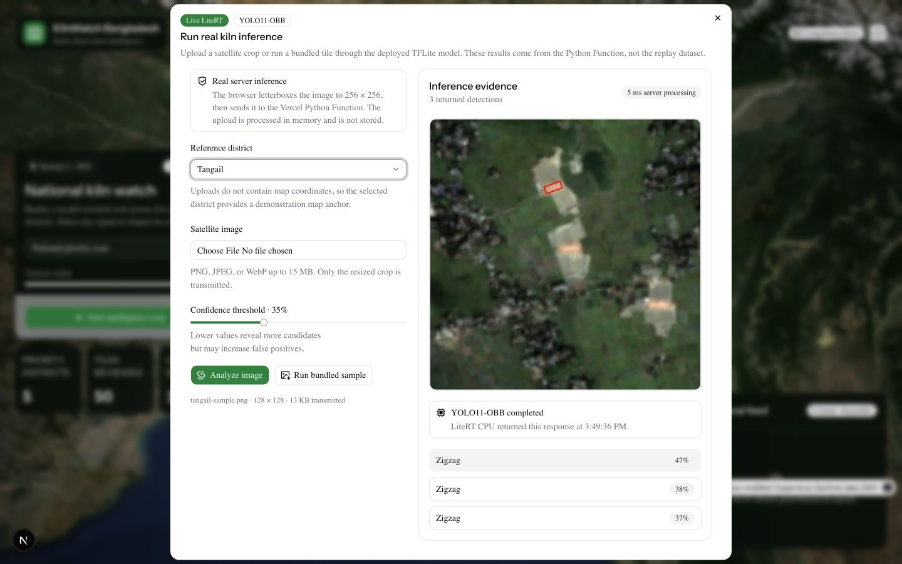
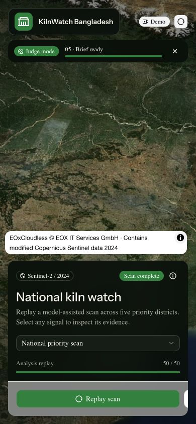
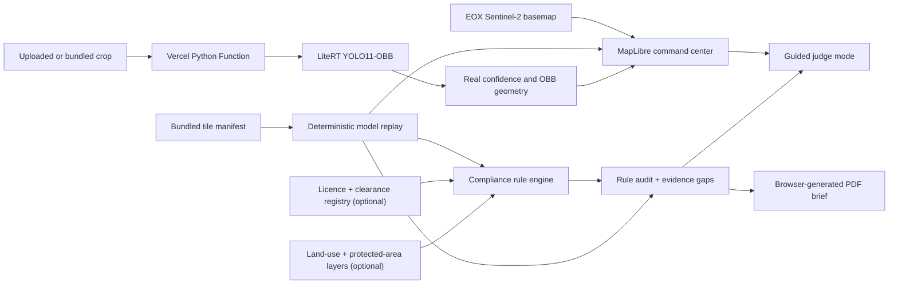

# KilnWatch Bangladesh

KilnWatch is a competition-ready earth-observation system for detecting possible brick kilns and screening them for suspected non-compliance across Bangladesh. It combines an instant national replay with real YOLO11-OBB inference: localize kiln structures, evaluate transparent location and technology rules, expose missing licence and land-use evidence, and export a field-verification brief.

The deployed experience is database-free and designed for Vercel's free tier. The Next.js command center is statically prerendered, while a Vercel Python Function runs the 10 MB TFLite checkpoint on CPU. It needs no paid map key, external GPU, or persistent storage.

> **Model and legal transparency:** the national scan replays deterministic, georeferenced outputs and prepared compliance inputs for a reliable presentation. The separate **Live AI** workflow runs the actual YOLO11-OBB TFLite checkpoint. An image can detect a kiln candidate; it cannot establish that a kiln is illegal without verified location layers, authority records, and field evidence.

## Demo screenshots

### National command center

The opening view combines freely served Sentinel-2 imagery, district controls, model selection, national statistics, and a streaming signal feed.



### Evidence review

Every signal opens a traceable evidence workspace. Compliance is the default view: each rule shows its basis, status, supporting evidence, and gaps. The imagery view separates the raw source tile from replayed oriented geometry.



### Imagery comparison

The separate imagery tab keeps the original source pixels and replayed model geometry inspectable without mixing visual detection with legal status.



### Live LiteRT proof

The **Live AI** action sends a browser-resized satellite crop to the Vercel Python Function. The returned class, confidence, OBB geometry, detection count, runtime, and processing time come directly from LiteRT rather than the replay manifest.



### Responsive presentation mode

The same judge workflow is designed for phones and narrow presentation windows. Satellite controls, attribution, progress, and the primary action remain usable without covering each other.

<p align="center">
  
</p>

## What the demo does

- Displays a full-screen MapLibre satellite command center centered on Bangladesh.
- Streams 50 prepared, georeferenced signals from five priority districts.
- Draws rotated geographic kiln polygons instead of generic point-only markers.
- Screens detections for potential residential-buffer and kiln-technology concerns.
- Keeps licence/clearance and prohibited-land-use checks explicitly unresolved until authoritative data is connected.
- Shows every compliance rule, legal basis, evidence type, and missing verification step.
- Switches between an ensemble view and three individual model perspectives.
- Runs real YOLO11-OBB inference through a Vercel Python Function.
- Accepts uploaded PNG, JPEG, and WebP satellite crops without storing them.
- Includes a bundled proof tile so judges can verify the live model path in one click.
- Runs a seven-second guided **Judge Mode** from national overview to evidence brief.
- Compares a raw Sentinel-2 tile against the AI-assisted geometry with an accessible slider.
- Shows imagery source, acquisition period, approximate resolution, coordinates, kiln class, confidence, and model agreement.
- Separates illustrative prioritization estimates from evidence-grade observations.
- Generates a downloadable A4 field-verification PDF entirely in the browser.
- Adapts to desktop, tablet, and mobile layouts.

## Guided judge workflow

Click **Judge mode** in the top model bar or the compact mobile action. The application then tells a complete story without requiring the presenter to hunt through the interface:

1. Establishes a national overview over Bangladesh.
2. Replays the priority-district scan.
3. Streams all 50 signals and renders their geographic geometry.
4. Applies a separate compliance screen after kiln detection.
5. Selects a high-concern Tangail signal with multiple review flags.
6. Opens its rule audit, registry gaps, and imagery evidence.
7. Leaves the interface ready to export a field-verification brief or answer questions.

The regular scan remains available for a presenter who wants manual control.

## Analysis pipeline

The competition interface presents three complementary model roles:

| View | Role in the demo | Why it helps |
| --- | --- | --- |
| **YOLO11-OBB** | Rotated kiln localization | Represents long, angled kiln structures more precisely than axis-aligned boxes. |
| **RT-DETR validator** | Independent object validation | Provides a second object-detection perspective for agreement-based triage. |
| **ViT context reviewer** | Scene-level kiln context | Represents surrounding visual context that object geometry alone may miss. |
| **Ensemble** | Mean confidence across all three views | Gives judges one prioritization score while preserving the individual model scores. |

Agreement is the number of replayed model scores at or above the 68% review threshold. The model switcher updates map colors, feed confidence, evidence values, and report context consistently.

These scores are deterministic demo data generated from the bundled manifest. They make the interaction fast, repeatable, free to host, and honest about what is and is not running at presentation time.

The **Live AI** dialog is intentionally separate from those scores. It uses `model/best.tflite` through `ai-edge-litert`, returns only genuine YOLO11-OBB detections, and reports server processing time. It never assigns RT-DETR, ViT, or ensemble values to an uploaded image.

## Illegal-kiln screening

The project now separates **physical detection** from **legal/compliance screening**:

1. **Detect a kiln candidate.** YOLO11-OBB or the replayed ensemble provides geometry, class, and confidence.
2. **Run measurable screening rules.** The demo checks an estimated residential/prohibited-area buffer and whether the replayed technology class matches the cleaner technology represented by Zigzag.
3. **Expose unavailable evidence.** Government licence and environmental-clearance records, agricultural/wetland/forest/ECA layers, verified household counts, operating status, and field observations remain visibly unresolved.
4. **Prioritize investigation.** Multiple replay flags produce **High-concern screen**; one produces **Compliance review**. Only a connected authority record marked expired or not found can produce **Probable non-compliance**.
5. **Require human determination.** No tier is labelled “illegal,” and every screen states that identity, current records, exceptions, straight-line distance, and field conditions must be verified.

The location rules are anchored to Section 8 of Bangladesh's [Brick Manufacturing and Brick Kilns Establishment (Control) Act, 2013](https://bangladesh.gov.bd/sites/default/files/files/bangladesh.gov.bd/gurd_files/2e08b992_2223_44a9_ae59_28b805e606bc/%E0%A6%93%20%E0%A6%AD%E0%A6%BE%E0%A6%9F%E0%A6%BE%20%E0%A6%B8%E0%A7%8D%E0%A6%A5%E0%A6%BE%E0%A6%AA%E0%A6%A8%20%28%E0%A6%A8%E0%A6%BF%E0%A7%9F%E0%A6%A8%E0%A7%8D%E0%A6%A4%E0%A7%8D%E0%A6%B0%E0%A6%A3%29%20%E0%A6%86%E0%A6%87%E0%A6%A8%2C%20%E0%A7%A8%E0%A7%A6%E0%A7%A7%E0%A7%A9.pdf), as amended in 2019. The workflow mirrors the evidence categories in the [brick-kiln enforcement inspection guide](https://faolex.fao.org/docs/pdf/BGD234326.pdf): technology and operating status; surrounding houses and sensitive facilities; GPS and straight-line distance; land category; environmental clearance; licence status; pollution controls; and field testimony.

The bundled values remain a deterministic competition replay. To make this production-capable, connect dated authority records and authoritative geospatial layers, record their provenance/version, and retain reviewer sign-off. The compliance engine in `lib/compliance-screening.ts` already accepts verified licence states without coupling the rules to a database vendor.

## Satellite imagery

The basemap uses MapLibre GL with the EOX Sentinel-2 Cloudless 2024 WMTS layer. This provides a convincing earth-observation interface without requiring a Google Maps key or embedding Google Earth.

- **Source:** EOX Sentinel-2 Cloudless
- **Period shown:** 2024 annual composite
- **Approximate ground resolution:** 10 m
- **Delivery:** live map tiles from EOX; the imagery itself is not a real-time satellite feed
- **Bundled evidence:** local demo tiles in `public/demo-tiles/` keep signal review deterministic

Source attribution stays visible in both desktop and mobile layouts.

### Image clarity and source limits

The bundled evidence crops and the source training images are 128 × 128 pixels. Enlarging those crops cannot reveal detail that the satellite export did not contain. The evidence workspace therefore defaults to a conservative **Clarity** view that applies display-only sharpening, contrast, and saturation. Reviewers can switch back to **Source** at any time, and the interface always displays the native resolution.

Clarity mode does **not** alter model input, confidence, OBB coordinates, or exported source evidence. It is deliberately not generative super-resolution: inventing roof edges, chimneys, or kiln texture would make the result look better while weakening its evidentiary value.

For genuinely better imagery, replace each local crop with a larger export covering the same bounds and update `model/tiles.json`. Keep the original file as the auditable source, record provider/date/resolution, and rerun inference because changing the crop changes the pixels seen by the model. The live EOX map remains useful for geographic context, but its annual composite is not an exact high-resolution substitute for a dated evidence crop.

## Evidence and reporting

Selecting a signal opens the evidence sheet with:

- raw imagery and replayed OBB geometry;
- compliance tier, flagged rules, and evidence gaps;
- Section 8 residential-buffer screening and cleaner-technology screening;
- explicit licence/clearance and prohibited-land-use registry gaps;
- active-model or ensemble confidence;
- three-model agreement;
- kiln class and risk tier;
- tile-center coordinates;
- imagery source, period, and resolution;
- illustrative settlement proximity and annual CO₂ context;
- a clear field-verification requirement.

The **Download evidence PDF** action creates a one-page A4 investigation brief using jsPDF. The report includes source geometry, compliance tier, every rule status and basis, registry state, provenance, and a prominent non-enforcement disclaimer. No evidence is uploaded to a server.

A visually verified example is available at [`output/pdf/kilnwatch-sample-evidence.pdf`](output/pdf/kilnwatch-sample-evidence.pdf).

## Architecture



The production page is statically prerendered by Next.js. Real inference is isolated in one Python Function, while the replay remains available if the function is cold or temporarily unavailable. There is no database, authentication provider, background worker, or external model server.

## Technology

- Next.js 16 App Router and React 19
- TypeScript with strict checking
- Tailwind CSS 4
- shadcn/ui and Radix primitives
- MapLibre GL for the satellite map
- EOX Sentinel-2 Cloudless imagery
- Vercel Python Functions and `ai-edge-litert`
- YOLO11-OBB exported as TFLite
- jsPDF for client-side evidence reports
- Bun for package management and scripts

## Quick start

Requirements:

- [Bun](https://bun.sh/)
- A modern browser with WebGL support

Install the frontend and Python runtime dependencies:

```bash
bun install
uv venv --python 3.12 .venv
uv pip install --python .venv/bin/python -r requirements.txt
```

Start the inference function:

```bash
PORT=8765 .venv/bin/python api/predict.py
```

Start Next.js in another terminal with its local API proxy:

```bash
PREDICT_API_BASE=http://127.0.0.1:8765 bun run dev
```

Open `http://localhost:3000`. Click **Judge mode** for the prepared national story or **Live AI** to run the real checkpoint.

## Production deployment: end to end

### What is required

| Service | Current role | Required? | Persistent data? |
| --- | --- | --- | --- |
| **Vercel** | Hosts Next.js, static assets, and the Python LiteRT function | Yes | No |
| **EOX WMTS** | Serves the Sentinel-2 Cloudless basemap | Yes for the map | No project account or key |
| **Convex** | Possible shared case/review backend | No; not wired into this repository | Yes |
| **Vercel Blob or R2** | Possible storage for original uploaded evidence | No; uploads are currently ephemeral | Yes |
| **Vercel Observability or Sentry** | Logs, errors, and performance monitoring | Optional | Operational telemetry |

The checked-in application needs no database, storage bucket, authentication provider, map token, or production environment variable. That is the recommended free competition deployment. Optional services should only be added when their capability is actually used; verify each provider's current free-tier limits before relying on it for public traffic.

### 1. Validate the release locally

Install both runtimes and validate the exact frontend build:

```bash
bun install
uv venv --python 3.12 .venv
uv pip install --python .venv/bin/python -r requirements.txt
bun run lint
bun run build
```

Test the complete local path in two terminals:

```bash
PORT=8765 .venv/bin/python api/predict.py
```

```bash
PREDICT_API_BASE=http://127.0.0.1:8765 bun run dev
```

Open `http://localhost:3000`, run **Judge mode**, open **Live AI**, choose **Bundled proof tile**, and confirm that a result reports `LiteRT CPU`, `YOLO11-OBB`, a processing time, and returned geometry.

### 2. Create the Vercel project

The simplest setup uses Vercel's Git integration:

1. Import the Git repository into Vercel.
2. Keep the detected framework as **Next.js**.
3. Keep the repository root as the project root.
4. Use `bun run build` only if automatic framework detection does not select the package script.
5. Leave environment variables empty for the current database-free build.
6. Deploy the branch and use its Preview URL for the full smoke test below.

Vercel installs `requirements.txt`, exposes `api/predict.py` at `/api/predict`, and applies the `/predict` rewrite from `vercel.json`. The function explicitly bundles `model/best.tflite`, `model/tiles.json`, and the proof tiles. `.vercelignore` excludes PyTorch weights, notebooks, datasets, run artifacts, documentation, and local environments.

Vercel's Git integration creates a Preview Deployment for branch pushes and a Production Deployment from the configured production branch. For a CLI-only deployment:

```bash
bunx vercel link
bunx vercel pull
bunx vercel deploy
# After the preview passes the smoke test:
bunx vercel deploy --prod
```

Do not set `PREDICT_API_BASE` on Vercel. In production the browser uses the same-origin `/predict` rewrite; that variable is only for the two-process local workflow.

### 3. Smoke-test the Preview Deployment

Replace the hostname below with the Preview URL:

```bash
export KILNWATCH_URL="https://your-preview.vercel.app"

curl -fsS "$KILNWATCH_URL/" >/dev/null
curl -fsS "$KILNWATCH_URL/predict?region=tangail&confidence=0.35&iou=0.45"
```

Then perform the browser path:

1. Confirm the satellite map loads and EOX attribution is visible.
2. Run **Judge mode** and verify that all 50 replay signals arrive.
3. Open a signal, toggle **Source / Clarity**, move the evidence slider, and download the PDF.
4. Run **Live AI** with the bundled proof tile. The first request can be slower because the Python function and LiteRT interpreter are cold.
5. Confirm that the live response contains `inference.mode`, `runtime`, `model`, `inputSize`, and `processingMs`.
6. Check Vercel deployment logs for Python import, missing-model, payload-size, or timeout errors.
7. Repeat at a narrow mobile viewport before promoting the release.

### 4. Promote and roll back

Merge the verified branch into the Vercel production branch or run `bunx vercel deploy --prod`. After release, repeat the home-page and live-inference checks against the production domain. If a release fails, use Vercel's Deployments screen to restore a previously healthy deployment, then investigate on a Preview URL.

### Environment-variable reference

| Variable | Where | Required now? | Purpose |
| --- | --- | --- | --- |
| `PREDICT_API_BASE` | Local Next.js process only | Only for local split-process development | Proxies `/predict` to local Python |
| `KILN_MODEL_INPUT_SIZE` | Python function | No; default `256` | Model input side length |
| `KILN_CONFIDENCE_THRESHOLD` | Python function | No; default `0.35` | Default confidence cutoff |
| `KILN_IOU_THRESHOLD` | Python function | No; default `0.45` | OBB non-maximum-suppression IoU |
| `KILN_MAX_UPLOAD_BYTES` | Python function | No; default 5 MiB | Decoded upload ceiling |
| `CONVEX_DEPLOY_KEY` | Vercel build environment | No; Convex option only | Authorizes Convex production or preview deploys |
| `NEXT_PUBLIC_CONVEX_URL` | Browser build | No; Convex option only | Connects a future Convex client to a deployment |

Never commit deploy keys, provider tokens, `.env.local`, or Vercel's local project metadata.

## Optional Convex setup

Convex is **not installed or used by the current demo**, and the static replay plus ephemeral live inference work without it. Add Convex only when the product needs shared review state such as analyst decisions, case notes, assignments, audit events, or saved evidence references.

A sensible first schema would store lightweight metadata rather than satellite binaries:

- `detections`: stable signal ID, coordinates, model/version, confidence, and imagery provenance;
- `reviews`: detection ID, reviewer, status, notes, and timestamp;
- `cases`: grouped detections, owner, priority, and field-verification state;
- `evidenceFiles`: object-storage URL, checksum, content type, size, and acquisition metadata.

Keep original images in Blob/R2 and keep only their immutable URL plus checksum in Convex. This avoids turning a transactional database into an image store and preserves a clearer chain of custody.

When the feature is ready to be implemented:

```bash
bun add convex
bunx convex dev
```

`convex dev` creates/selects a development deployment and writes its local deployment values to `.env.local`. Add a client provider using `NEXT_PUBLIC_CONVEX_URL`, create a typed schema and mutations under `convex/`, and keep the existing static manifest as a no-backend demo fallback.

For coordinated Vercel + Convex production deployment:

1. Generate a production deploy key in the Convex dashboard with deployment permission.
2. Add it to Vercel as `CONVEX_DEPLOY_KEY` for **Production** only.
3. Change the Vercel Build Command to `bunx convex deploy --cmd 'bun run build'`.
4. Generate a separate Convex Preview deploy key and scope it to Vercel's **Preview** environment if isolated per-branch data is desired.
5. Confirm that Preview and Production builds point at different Convex deployments before storing real reviews.

Do not add these variables or change the build command until Convex code exists in this repository. Doing so now adds deployment complexity without improving the competition demo.

## Optional storage and operations

Uploaded Live AI images are resized in the browser, sent to the function, analyzed in memory, and discarded. To retain them later, upload the untouched original directly to Vercel Blob or an S3-compatible bucket, record its SHA-256 checksum and metadata, and pass only a bounded derivative to inference. Add authentication, signed uploads, retention rules, and deletion controls before accepting non-demo evidence.

For operations, start with Vercel build/function logs and a synthetic check that exercises `/` and `/predict`. Add an error tracker only when there is a real alert recipient. Never log base64 image payloads, deploy keys, or personally identifying field notes.

## Project structure

```text
app/                         Next.js routes, metadata, and global theme
components/CommandCenter/    Map, judge workflow, model controls, and evidence UI
components/ui/               shadcn/ui building blocks
api/predict.py               Vercel Python Function and LiteRT inference
lib/demo-data.ts             Georeferenced detections and deterministic model scores
lib/demo-models.ts           Model identities, roles, and view types
lib/compliance-screening.ts  Auditable legal-screening rules and evidence states
lib/image-preprocess.ts       Browser resizing and request-size control
lib/evidence-report.ts       Browser-side A4 PDF generation
model/best.tflite             Deployed YOLO11-OBB checkpoint
model/tiles.json             Bundled signal manifest used by the frontend
public/demo-tiles/           Local satellite evidence tiles
ml/                          Optional MPS training and model bake-off tooling
docs/images/                 Production README screenshots
```

## Optional model development

The replay does not require Python, but live inference does. The repository also contains a separate experimental pipeline under `ml/` for work on the MacBook GPU through PyTorch MPS. It includes dataset preparation, region-aware splits, balanced dataset configuration, training, evaluation, and model bake-off scripts.

Start with [`ml/README.md`](ml/README.md) and [`ml/EXPERIMENTS.md`](ml/EXPERIMENTS.md). Model weights, datasets, run directories, and virtual environments are intentionally excluded from Vercel and should not be committed.

`api/predict.py` is the production LiteRT path. Module-level interpreter reuse reduces warm-request latency, and access to the mutable interpreter is serialized for safe concurrent requests.

## Responsible-use limitations

- A model signal or screening flag is an investigation lead, not proof of an illegal kiln.
- The 2024 layer is an annual cloudless composite, not current or real-time imagery.
- Settlement proximity, technology class, compliance flags, and annual emissions are illustrative competition replay values.
- Kiln ownership, operating status, permit status, imagery date, and applicable law require independent verification.
- Field review and human judgment are required before enforcement or public claims.

## Useful commands

```bash
bun run dev      # Start development mode
bun run lint     # Run ESLint
bun run build    # Type-check and create the production build
bun run start    # Serve the production build
```

## Data coverage

The bundled demo includes ten evidence tiles for each of five priority districts:

- Brahmanbaria
- Jessore
- Manikganj
- Mymensingh
- Tangail

Region metadata lives in `seed-data/regions.json` and is exposed to the interface through `lib/regions.ts`.
